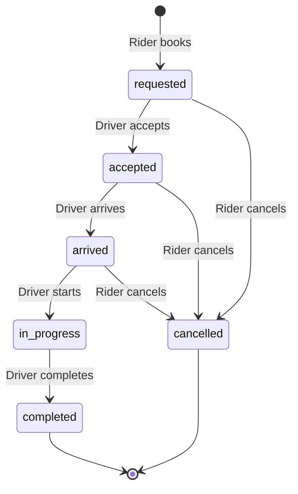

<div align="center">

# Orbit ↗

### Your city. On your terms.

A full-stack cab-booking portfolio project with a custom responsive interface, persistent ride records, and separate rider and driver workflows.

[Live app](https://orbit-cab-keeruru.groovy-siren-4695.chatgpt.site) · [Getting started](#getting-started) · [Architecture](docs/ARCHITECTURE.md) · [API reference](docs/API.md) · [Roadmap](#roadmap)


</div>

## About

Orbit explores the complete journey of requesting a cab: choosing a route and vehicle class, accepting the request as a driver, updating trip progress, recording cash collection, and leaving a review. Its UI combines forest-green navigation, warm ivory surfaces, terracotta accents, serif headings, and an illustrated Bengaluru route map.

This is an educational and portfolio project. It is not connected to a real taxi fleet. Map routes, distances, fares, and ETAs use sample data.

## Features

| Area                  | Implemented behavior                                                                                   |
| --------------------- | ------------------------------------------------------------------------------------------------------ |
| Authentication        | Sites-managed ChatGPT sign-in; authenticated API access                                                |
| Rider dashboard       | Select pickup and destination, choose Go / Comfort / XL, see a fare estimate, request or cancel a ride |
| Driver dashboard      | Shared request queue, conditional acceptance, arrival / start / completion controls                    |
| Profiles              | Persistent name, phone number, image URL, and rider / driver mode                                      |
| Ride updates          | Server-backed status refreshed every six seconds; in-app messages                                      |
| Journey history       | Account-owned ride records, statuses, route details, and fares                                         |
| Payments and earnings | Driver-confirmed cash records and completed-trip totals                                                |
| Receipts              | Downloadable text receipts for completed journeys                                                      |
| Reviews               | Rider-owned ratings from 1–5 and written feedback                                                      |
| Responsive UI         | Desktop dashboard, mobile navigation, accessible labels, keyboard focus indicators                     |

## Tech stack

| Layer              | Technology                                 | Purpose                                           |
| ------------------ | ------------------------------------------ | ------------------------------------------------- |
| UI                 | React 19, TypeScript                       | Interactive components and typed application code |
| Framework          | Vinext, Next.js-compatible App Router APIs | Server rendering and API routes                   |
| Styling            | Tailwind CSS 4 and custom CSS              | Responsive layout and bespoke visual design       |
| Icons              | Lucide React                               | Consistent interface icons                        |
| Database           | Cloudflare D1                              | Persistent SQLite records                         |
| ORM and migrations | Drizzle ORM / Drizzle Kit                  | Queries, schema definitions, committed migrations |
| Authentication     | ChatGPT Sites identity                     | Verified identity at the hosting boundary         |
| Hosting            | ChatGPT Sites / Cloudflare Workers         | Current live deployment                           |
| Tests              | Node.js test assertions, SQLite            | API authorization and ride workflow checks        |

**Hosting status:** the Sites deployment is live and private. Vercel and Render deployments are pending. The current Worker/D1 build cannot be deployed unchanged to a standard Node.js host: authentication and database adapters need migration first. Neither Clerk, Stripe, Google Maps, nor PostgreSQL is currently integrated.

## Getting started

### Prerequisites

- Node.js **24.x** recommended (tests use the built-in `node:sqlite` API).
- pnpm **11.25.0**, matching `packageManager` in `package.json`.
- A supported local development environment for Cloudflare Workers.

### Install and run

```bash
git clone https://github.com/Keerti707/orbit-cab.git
cd orbit-cab
pnpm install
pnpm db:local
pnpm dev
```

The portable development server uses `http://localhost:5173`. Local preview identity is supplied by the starter's development integration; it does not sign you into the hosted app. Local D1 data and hosted D1 data are separate.

### Commands

| Command            | Purpose                                               |
| ------------------ | ----------------------------------------------------- |
| `pnpm dev`         | Run the local Vinext development server               |
| `pnpm build`       | Create the production Worker build                    |
| `pnpm typecheck`   | Check TypeScript without emitting files               |
| `pnpm test`        | Exercise the API against an in-memory SQLite database |
| `pnpm db:generate` | Generate schema migrations after a schema change      |
| `pnpm db:local`    | Apply committed migrations to local D1                |

The hosting manifest enables the `DB` binding. It contains no credentials. Provider credentials, session secrets, and any future API keys must remain outside Git.

## Try the complete flow

1. Open the live app and sign in as a rider.
2. Select different pickup and destination locations, choose a vehicle class, and request a ride.
3. Use a second account with access to the Site. Change that account's profile mode to **Driver**.
4. Accept the request, mark arrival, start the ride, then complete it and record cash collection.
5. Return to the rider account to view progress, download the receipt, and submit a review.

The live Site is owner-private. Its owner must grant a second tester access before cross-account testing. Account mode selection is an educational workflow; it does not verify a driver's identity, license, or vehicle.

## Ride lifecycle



Ride acceptance uses a conditional database update to avoid assigning the same request twice. The assigned driver controls progress. A rider can review only their own completed trip.

## Project structure

```text
app/                    Pages, client dashboard, styles, authentication helper
app/api/orbit/          Authenticated ride and profile API
db/                    Drizzle database adapter and schema
drizzle/               Committed SQL migrations and metadata
tests/                 API workflow checks
docs/                  Architecture, API and deployment documentation
scripts/               Framework/build environment helpers
build/                 Sites Worker and Vite integration
public/                Static assets
.github/               CI and contribution templates
```

## Validation

TypeScript checking, the production Worker build, and API workflow tests passed during initial development. Tests cover unauthenticated access, record ownership, input validation, fare calculation, duplicate active bookings, driver acceptance, valid transitions, cash completion, and ratings.

Browser-level visual and cross-account hosted verification have not been completed. CI is configured to rerun type checking, tests, and the build on GitHub once source is uploaded and Actions is available.

## Known limitations

- The SVG map is an illustration, not Google Maps or GPS navigation.
- Six Bengaluru locations, sample distances, and illustrative ETAs are supported.
- Drivers manually accept requests; there is no nearest-driver dispatch algorithm.
- Cash records reflect driver confirmation, not verified payment settlement.
- Stripe checkout, payment webhooks, refunds, and card storage are absent.
- Updates use polling rather than WebSockets or push notifications.
- Driver mode is self-selected; commercial driver onboarding is absent.
- Active-ride checks are not fully transactional across simultaneous requests. Production dispatch needs stronger database constraints.
- Receipts are text files; PDF generation is not implemented.

## Roadmap

- [ ] Portable Next.js deployment for Vercel and Render
- [ ] PostgreSQL and managed authentication integration
- [ ] Real geocoding, directions, distance and ETA calculation
- [ ] Verified driver and vehicle onboarding
- [ ] Transactional dispatch and nearest-driver matching
- [ ] Stripe checkout and signed webhook reconciliation
- [ ] Realtime ride tracking and notifications
- [ ] Browser integration tests and PDF receipts

## Contributing

See [CONTRIBUTING.md](CONTRIBUTING.md). Please report reproducible bugs through an issue, and describe validation in pull requests. Security issues should not be posted publicly; see [SECURITY.md](SECURITY.md).

## Author and licensing

Maintained by [Keerti707](https://github.com/Keerti707). This project was developed with AI assistance.

Original Orbit application code is available under the [MIT License](LICENSE). Third-party dependencies and bundled starter assets retain their own licenses and notices.
